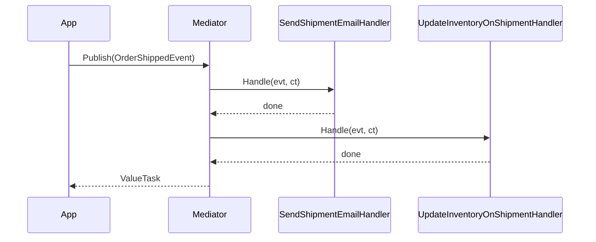
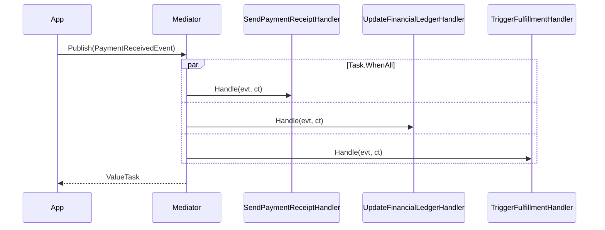
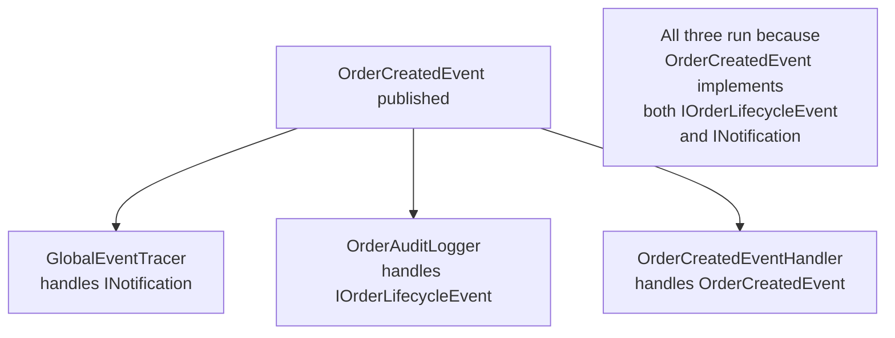

# Notifications

Notifications (domain events) broadcast a fact that something happened. Unlike requests, they have no return value and can have zero or many handlers. ZeroAlloc.Mediator supports three dispatch modes: sequential, parallel, and polymorphic.

## Sequential Notifications (default)

When an order ships, you may need to send a confirmation email AND update inventory. With sequential dispatch (the default), handlers run one after another in the order the source generator discovers them.

```csharp
using ZeroAlloc.Mediator;

public readonly record struct OrderShippedEvent(
    Guid OrderId,
    string TrackingNumber,
    DateTimeOffset ShippedAt
) : INotification;
```

```csharp
public class SendShipmentEmailHandler : INotificationHandler<OrderShippedEvent>
{
    private readonly IEmailService _email;
    public SendShipmentEmailHandler(IEmailService email) => _email = email;

    public async ValueTask Handle(OrderShippedEvent evt, CancellationToken ct)
        => await _email.SendShipmentConfirmationAsync(evt.OrderId, evt.TrackingNumber, ct);
}

public class UpdateInventoryOnShipmentHandler : INotificationHandler<OrderShippedEvent>
{
    private readonly IInventoryService _inventory;
    public UpdateInventoryOnShipmentHandler(IInventoryService inventory) => _inventory = inventory;

    public ValueTask Handle(OrderShippedEvent evt, CancellationToken ct)
    {
        _inventory.RecordShipment(evt.OrderId);
        return ValueTask.CompletedTask;
    }
}
```

Publishing:

```csharp
await Mediator.Publish(
    new OrderShippedEvent(orderId, "1Z999AA10123456784", DateTimeOffset.UtcNow),
    ct);
```



## Parallel Notifications

Use `[ParallelNotification]` when handlers are independent of one another and latency matters. All handlers run concurrently via `Task.WhenAll`, so the total dispatch time is bounded by the slowest handler rather than the sum of all handlers.

```csharp
[ParallelNotification]
public readonly record struct PaymentReceivedEvent(
    Guid OrderId,
    decimal Amount,
    string PaymentMethod
) : INotification;

public class SendPaymentReceiptHandler : INotificationHandler<PaymentReceivedEvent>
{
    public async ValueTask Handle(PaymentReceivedEvent evt, CancellationToken ct)
        => await _email.SendReceiptAsync(evt.OrderId, evt.Amount, ct);
}

public class UpdateFinancialLedgerHandler : INotificationHandler<PaymentReceivedEvent>
{
    public async ValueTask Handle(PaymentReceivedEvent evt, CancellationToken ct)
        => await _ledger.RecordPaymentAsync(evt.OrderId, evt.Amount, ct);
}

public class TriggerFulfillmentHandler : INotificationHandler<PaymentReceivedEvent>
{
    public async ValueTask Handle(PaymentReceivedEvent evt, CancellationToken ct)
        => await _fulfillment.StartAsync(evt.OrderId, ct);
}
```



## Polymorphic Handlers

A handler for a base type automatically handles all derived types. The source generator scans `AllInterfaces` at compile time — there is no runtime type checking involved. This enables you to write cross-cutting handlers that operate on a family of related events without modifying each event type.

```csharp
// Base marker interface
public interface IOrderLifecycleEvent : INotification
{
    Guid OrderId { get; }
}

// Concrete events
public readonly record struct OrderCreatedEvent(Guid OrderId, string CustomerId)
    : IOrderLifecycleEvent;

public readonly record struct OrderCancelledEvent(Guid OrderId, string Reason)
    : IOrderLifecycleEvent;

public readonly record struct OrderShippedEvent(Guid OrderId, string TrackingNumber, DateTimeOffset ShippedAt)
    : IOrderLifecycleEvent;

// Handles ALL IOrderLifecycleEvent types automatically
public class OrderAuditLogger : INotificationHandler<IOrderLifecycleEvent>
{
    private readonly IAuditLog _audit;
    public OrderAuditLogger(IAuditLog audit) => _audit = audit;

    public ValueTask Handle(IOrderLifecycleEvent evt, CancellationToken ct)
    {
        _audit.Log($"[{DateTimeOffset.UtcNow:O}] Order {evt.OrderId}: {evt.GetType().Name}");
        return ValueTask.CompletedTask;
    }
}

// Global handler — receives every notification in the app
public class GlobalEventTracer : INotificationHandler<INotification>
{
    public ValueTask Handle(INotification evt, CancellationToken ct)
    {
        Trace.WriteLine($"[EVENT] {evt.GetType().Name} at {DateTimeOffset.UtcNow:HH:mm:ss.fff}");
        return ValueTask.CompletedTask;
    }
}
```

When `OrderCreatedEvent` is published, the dispatch order is:

1. `GlobalEventTracer.Handle(evt)` — handles `INotification`
2. `OrderAuditLogger.Handle(evt)` — handles `IOrderLifecycleEvent`
3. Any `INotificationHandler<OrderCreatedEvent>` handler



## Common Pitfalls

**Pitfall 1 — Parallel handlers with shared mutable state**

If two parallel handlers write to the same `List<T>` or counter, you will get race conditions. Use sequential dispatch for handlers that share state, or use thread-safe types such as `ConcurrentBag<T>` or `Interlocked`.

**Pitfall 2 — Exception handling in parallel dispatch**

`Task.WhenAll` collects ALL exceptions. If `SendPaymentReceiptHandler` and `UpdateFinancialLedgerHandler` both throw, both exceptions are wrapped in an `AggregateException`. Handle this at the publish call site rather than assuming only a single exception can propagate.

**Pitfall 3 — Polymorphic handlers are automatic**

You do NOT need to register the base handler separately. The generator includes it automatically for every concrete notification type that satisfies the base interface. Registering it twice would be wrong and unsupported.

**Pitfall 4 — No handler is fine**

Publishing a notification with zero handlers is valid — `Mediator.Publish` completes immediately. This is intentional; events are fire-and-forget broadcast signals, not commands that require a recipient.
