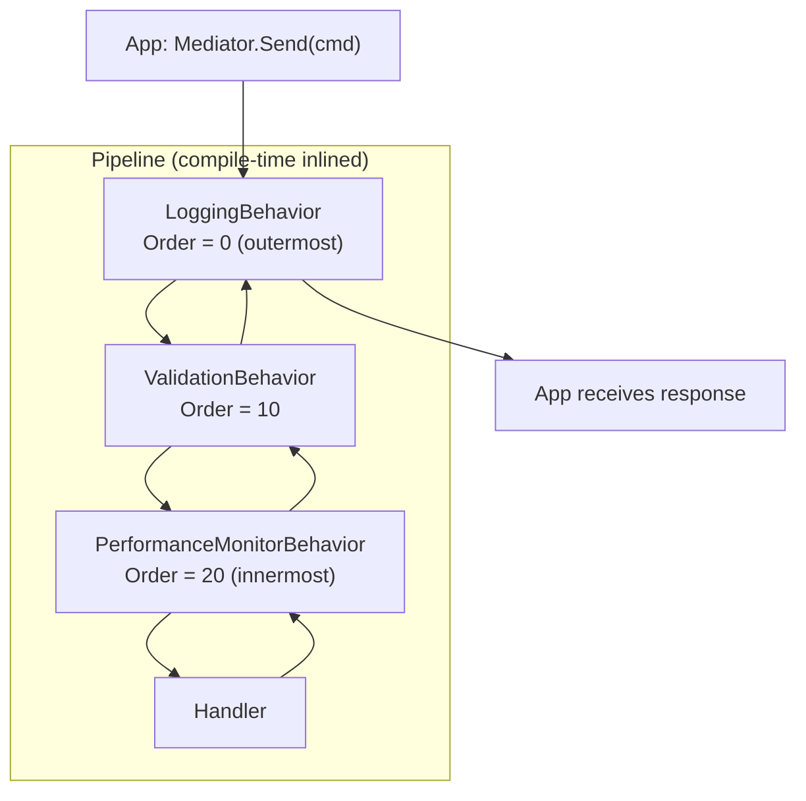

# Pipeline Behaviors

Pipeline behaviors are middleware that wrap every request dispatch. They are the right place for cross-cutting concerns: logging, validation, performance monitoring, caching, and transactions. Unlike MediatR's `IPipelineBehavior<TRequest, TResponse>`, ZeroAlloc.Mediator inlines behaviors at compile time as nested static lambdas — no interface allocation, no virtual dispatch, zero overhead.

## Anatomy of a Pipeline Behavior

```csharp
using System.Diagnostics;
using ZeroAlloc.Mediator;

[PipelineBehavior(Order = 0)]
public static class LoggingBehavior
{
    public static async ValueTask<TResponse> Handle<TRequest, TResponse>(
        TRequest request,
        CancellationToken ct,
        Func<TRequest, CancellationToken, ValueTask<TResponse>> next)
    {
        var name = typeof(TRequest).Name;
        var sw = Stopwatch.StartNew();
        Console.WriteLine($"[START] {name}");
        try
        {
            var response = await next(request, ct);
            Console.WriteLine($"[END] {name} completed in {sw.ElapsedMilliseconds}ms");
            return response;
        }
        catch (Exception ex)
        {
            Console.WriteLine($"[FAIL] {name} failed after {sw.ElapsedMilliseconds}ms: {ex.Message}");
            throw;
        }
    }
}
```

- `static class` — required; behaviors have no instance state
- `[PipelineBehavior(Order = 0)]` — Order=0 = outermost (first to run, last to complete)
- `Handle<TRequest, TResponse>` — generic; applies to ALL request types globally
- `next(request, ct)` — calls the next behavior, or the final handler if this is the innermost behavior
- Must `await next(...)` and return the result — forgetting this silently drops the response

## Ordering Multiple Behaviors

```csharp
[PipelineBehavior(Order = 0)]
public static class LoggingBehavior { ... }      // outermost — runs before all, completes after all

[PipelineBehavior(Order = 10)]
public static class ValidationBehavior { ... }   // middle

[PipelineBehavior(Order = 20)]
public static class PerformanceMonitorBehavior { ... }  // innermost — closest to handler
```

Execution order on the way IN (before handler): Logging → Validation → PerformanceMonitor → Handler

Execution order on the way OUT (after handler): Handler → PerformanceMonitor → Validation → Logging

Convention: use gaps of 10 between Order values so you can insert new behaviors later without renumbering.



## Scoped Behaviors with AppliesTo

Use `AppliesTo` to target a behavior at exactly one request type. Other requests skip it entirely.

```csharp
[PipelineBehavior(Order = 5, AppliesTo = typeof(PlaceOrderCommand))]
public static class OrderStockValidationBehavior
{
    public static async ValueTask<TResponse> Handle<TRequest, TResponse>(
        TRequest request,
        CancellationToken ct,
        Func<TRequest, CancellationToken, ValueTask<TResponse>> next)
    {
        if (request is PlaceOrderCommand cmd)
        {
            foreach (var item in cmd.Items)
            {
                if (item.Quantity <= 0)
                    throw new InvalidOperationException($"Quantity for {item.Sku} must be positive.");
            }
        }

        return await next(request, ct);
    }
}
```

Note: `AppliesTo` accepts a concrete request type, not an interface. The generator uses this to only include the behavior in the dispatch chain for that specific type.

## Practical Example — Exception Handling Behavior

```csharp
[PipelineBehavior(Order = 0)]
public static class ExceptionHandlingBehavior
{
    public static async ValueTask<TResponse> Handle<TRequest, TResponse>(
        TRequest request,
        CancellationToken ct,
        Func<TRequest, CancellationToken, ValueTask<TResponse>> next)
    {
        try
        {
            return await next(request, ct);
        }
        catch (NotFoundException ex)
        {
            // Re-throw as a domain-friendly exception
            throw new DomainException($"Resource not found: {ex.Message}", ex);
        }
        catch (OperationCanceledException) when (ct.IsCancellationRequested)
        {
            // Let cancellation propagate naturally
            throw;
        }
        catch (Exception ex)
        {
            // Log and re-throw unexpected exceptions
            Console.Error.WriteLine($"Unhandled exception in {typeof(TRequest).Name}: {ex}");
            throw;
        }
    }
}
```

## How Inlining Works (Conceptual)

Instead of building a `List<IPipelineBehavior>` at runtime and iterating it, the generator emits code like:

```csharp
// Conceptual — what the generator emits for PlaceOrderCommand with 3 behaviors
public static ValueTask<OrderId> Send(PlaceOrderCommand request, CancellationToken ct = default)
    => LoggingBehavior.Handle(request, ct, (req, token) =>
        ValidationBehavior.Handle(req, token, (req2, token2) =>
            OrderStockValidationBehavior.Handle(req2, token2, (req3, token3) =>
                (_placeOrderHandlerFactory?.Invoke() ?? new PlaceOrderHandler()).Handle(req3, token3))));
```

Zero allocation. No list. No delegates stored on the heap. No virtual calls.

## Common Pitfalls

**Pitfall 1 — Non-static class (ZAM005)**

```csharp
// ❌ Must be static
[PipelineBehavior(Order = 0)]
public class LoggingBehavior { ... }

// ✅ Correct
[PipelineBehavior(Order = 0)]
public static class LoggingBehavior { ... }
```

**Pitfall 2 — Forgetting to call `next`**

```csharp
// ❌ Response is lost — handler never called
public static async ValueTask<TResponse> Handle<TRequest, TResponse>(
    TRequest request, CancellationToken ct,
    Func<TRequest, CancellationToken, ValueTask<TResponse>> next)
{
    Console.WriteLine("Before");
    // forgot: return await next(request, ct);
    return default!;
}
```

**Pitfall 3 — Duplicate Order values (ZAM006)**

```csharp
// ❌ Both Order=10 — execution order is non-deterministic
[PipelineBehavior(Order = 10)]
public static class ValidationBehavior { ... }

[PipelineBehavior(Order = 10)]
public static class CachingBehavior { ... }

// ✅ Use unique values with gaps
[PipelineBehavior(Order = 10)]
public static class ValidationBehavior { ... }

[PipelineBehavior(Order = 20)]
public static class CachingBehavior { ... }
```

**Pitfall 4 — Accessing DI services from a static behavior**

Static behaviors have no instance state. To access services (e.g., `ILogger`, `DbContext`), use an ambient scope pattern. See [Dependency Injection](06-dependency-injection.md) and the [Transactional Pipeline cookbook](cookbook/04-transactional-pipeline.md).
