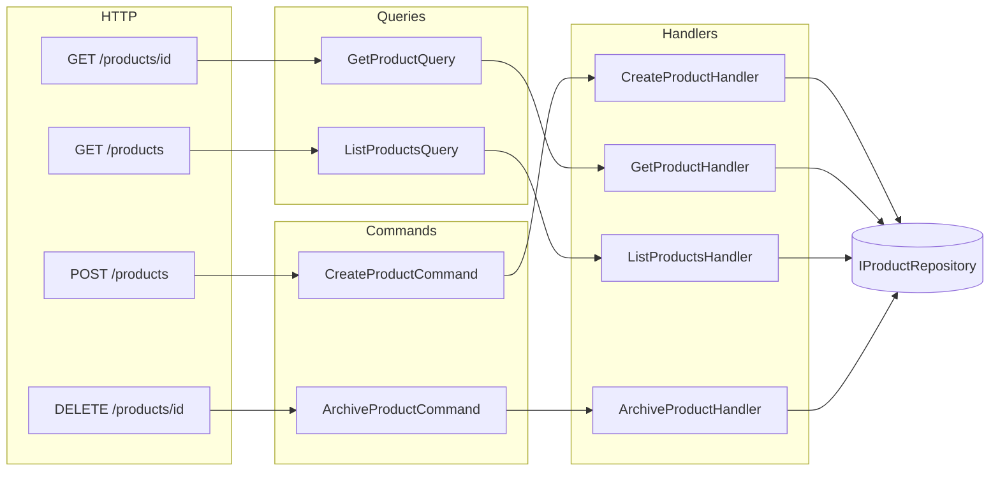

# Cookbook: CQRS with ASP.NET Core Minimal API

This recipe shows how to build a product catalog API using CQRS — commands for writes, queries for reads — with ZeroAlloc.Mediator as the dispatcher.

## What We're Building

A product catalog service with 4 endpoints:

- `POST /products` → `CreateProductCommand` → returns `201 Created` with `ProductId`
- `GET /products/{id}` → `GetProductQuery` → returns `200 OK` with `ProductDto`
- `GET /products` → `ListProductsQuery` → returns `200 OK` with `PagedResult<ProductDto>`
- `DELETE /products/{id}` → `ArchiveProductCommand` → returns `204 No Content`

## Project Setup

```bash
dotnet new web -n ProductCatalog
cd ProductCatalog
dotnet add package ZeroAlloc.Mediator
```

## Request Types

All requests and result types are `readonly record struct` to keep allocations at zero on the hot path:

```csharp
using ZeroAlloc.Mediator;

// Commands
public readonly record struct CreateProductCommand(
    string Name,
    string Sku,
    decimal Price,
    int StockLevel
) : IRequest<ProductId>;

public readonly record struct ArchiveProductCommand(Guid ProductId) : IRequest;

// Queries
public readonly record struct GetProductQuery(Guid ProductId) : IRequest<ProductDto>;

public readonly record struct ListProductsQuery(
    string? SkuPrefix,
    decimal? MaxPrice,
    int Page,
    int PageSize
) : IRequest<PagedResult<ProductDto>>;

// Result types
public readonly record struct ProductId(Guid Value);

public readonly record struct ProductDto(
    Guid Id,
    string Name,
    string Sku,
    decimal Price,
    int StockLevel,
    bool IsArchived
);

public readonly record struct PagedResult<T>(
    IReadOnlyList<T> Items,
    int TotalCount,
    int Page,
    int PageSize
);
```

## Handlers

Each handler takes an `IProductRepository` dependency and contains the business logic for its slice of the API:

```csharp
public class CreateProductHandler : IRequestHandler<CreateProductCommand, ProductId>
{
    private readonly IProductRepository _repo;
    public CreateProductHandler(IProductRepository repo) => _repo = repo;

    public async ValueTask<ProductId> Handle(CreateProductCommand cmd, CancellationToken ct)
    {
        if (string.IsNullOrWhiteSpace(cmd.Name))
            throw new ArgumentException("Product name is required.", nameof(cmd));
        if (cmd.Price <= 0)
            throw new ArgumentOutOfRangeException(nameof(cmd), "Price must be positive.");

        var id = Guid.NewGuid();
        await _repo.CreateAsync(id, cmd.Name, cmd.Sku, cmd.Price, cmd.StockLevel, ct);
        return new ProductId(id);
    }
}

public class ArchiveProductHandler : IRequestHandler<ArchiveProductCommand, Unit>
{
    private readonly IProductRepository _repo;
    public ArchiveProductHandler(IProductRepository repo) => _repo = repo;

    public async ValueTask<Unit> Handle(ArchiveProductCommand cmd, CancellationToken ct)
    {
        var exists = await _repo.ExistsAsync(cmd.ProductId, ct);
        if (!exists) throw new ProductNotFoundException(cmd.ProductId);
        await _repo.ArchiveAsync(cmd.ProductId, ct);
        return Unit.Value;
    }
}

public class GetProductHandler : IRequestHandler<GetProductQuery, ProductDto>
{
    private readonly IProductRepository _repo;
    public GetProductHandler(IProductRepository repo) => _repo = repo;

    public async ValueTask<ProductDto> Handle(GetProductQuery query, CancellationToken ct)
    {
        var product = await _repo.FindAsync(query.ProductId, ct)
            ?? throw new ProductNotFoundException(query.ProductId);
        return new ProductDto(product.Id, product.Name, product.Sku, product.Price, product.StockLevel, product.IsArchived);
    }
}

public class ListProductsHandler : IRequestHandler<ListProductsQuery, PagedResult<ProductDto>>
{
    private readonly IProductRepository _repo;
    public ListProductsHandler(IProductRepository repo) => _repo = repo;

    public async ValueTask<PagedResult<ProductDto>> Handle(ListProductsQuery query, CancellationToken ct)
    {
        var (items, total) = await _repo.ListAsync(query.SkuPrefix, query.MaxPrice, query.Page, query.PageSize, ct);
        var dtos = items.Select(p => new ProductDto(p.Id, p.Name, p.Sku, p.Price, p.StockLevel, p.IsArchived))
                        .ToList();
        return new PagedResult<ProductDto>(dtos, total, query.Page, query.PageSize);
    }
}
```

## Wiring Up (Program.cs)

Register the repository, handlers, and `IMediator` in the DI container, then map each endpoint to the appropriate request type:

```csharp
using ZeroAlloc.Mediator;

var builder = WebApplication.CreateBuilder(args);

// Register repository
builder.Services.AddSingleton<IProductRepository, InMemoryProductRepository>();

// Register handlers
builder.Services.AddTransient<CreateProductHandler>();
builder.Services.AddTransient<ArchiveProductHandler>();
builder.Services.AddTransient<GetProductHandler>();
builder.Services.AddTransient<ListProductsHandler>();

// Register IMediator
builder.Services.AddSingleton<IMediator>(sp =>
{
    Mediator.Configure(cfg =>
    {
        cfg.SetFactory(() => sp.GetRequiredService<CreateProductHandler>());
        cfg.SetFactory(() => sp.GetRequiredService<ArchiveProductHandler>());
        cfg.SetFactory(() => sp.GetRequiredService<GetProductHandler>());
        cfg.SetFactory(() => sp.GetRequiredService<ListProductsHandler>());
    });
    return new MediatorService();
});

var app = builder.Build();

// POST /products
app.MapPost("/products", async (CreateProductRequest req, IMediator mediator, CancellationToken ct) =>
{
    var id = await mediator.Send(
        new CreateProductCommand(req.Name, req.Sku, req.Price, req.StockLevel), ct);
    return Results.Created($"/products/{id.Value}", id);
});

// GET /products/{id}
app.MapGet("/products/{id:guid}", async (Guid id, IMediator mediator, CancellationToken ct) =>
{
    try
    {
        var dto = await mediator.Send(new GetProductQuery(id), ct);
        return Results.Ok(dto);
    }
    catch (ProductNotFoundException)
    {
        return Results.NotFound();
    }
});

// GET /products
app.MapGet("/products", async (
    string? skuPrefix, decimal? maxPrice, int page = 1, int pageSize = 20,
    IMediator mediator = null!, CancellationToken ct = default) =>
{
    var result = await mediator.Send(
        new ListProductsQuery(skuPrefix, maxPrice, page, pageSize), ct);
    return Results.Ok(result);
});

// DELETE /products/{id}
app.MapDelete("/products/{id:guid}", async (Guid id, IMediator mediator, CancellationToken ct) =>
{
    try
    {
        await mediator.Send(new ArchiveProductCommand(id), ct);
        return Results.NoContent();
    }
    catch (ProductNotFoundException)
    {
        return Results.NotFound();
    }
});

app.Run();

// Request body record for POST
public record CreateProductRequest(string Name, string Sku, decimal Price, int StockLevel);

public class ProductNotFoundException : Exception
{
    public ProductNotFoundException(Guid id) : base($"Product {id} not found.") { }
}
```

## Architecture Diagram



## Adding a Logging Behavior

A single pipeline behavior covers all 4 endpoints with no per-handler boilerplate:

```csharp
using System.Diagnostics;

[PipelineBehavior(Order = 0)]
public static class LoggingBehavior
{
    public static async ValueTask<TResponse> Handle<TRequest, TResponse>(
        TRequest request,
        CancellationToken ct,
        Func<TRequest, CancellationToken, ValueTask<TResponse>> next)
    {
        var name = typeof(TRequest).Name;
        var sw = Stopwatch.StartNew();
        try
        {
            var result = await next(request, ct);
            Console.WriteLine($"[OK] {name} in {sw.ElapsedMilliseconds}ms");
            return result;
        }
        catch (Exception ex)
        {
            Console.WriteLine($"[ERR] {name} failed: {ex.Message}");
            throw;
        }
    }
}
```

No registration needed — the source generator detects `[PipelineBehavior]` automatically and inlines the behavior into every `Send` call.

## Related

- [Requests & Handlers](../requests.md)
- [Pipeline Behaviors](../pipeline-behaviors.md)
- [Dependency Injection](../dependency-injection.md)
- [Validation Pipeline](03-validation-pipeline.md)
