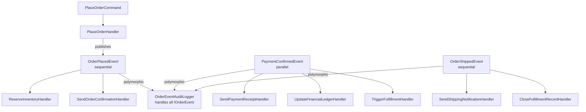

# Cookbook: Event-Driven Architecture

This recipe shows how to use notifications to decouple domain operations from their side effects. A command handler places an order; independent notification handlers react by sending emails, updating inventory, and writing to an audit log — without the command handler knowing anything about them.

## The Scenario

An e-commerce order lifecycle. When an order is placed, several things must happen: inventory reserved, confirmation email sent. When payment is confirmed (independent of order placement), three things happen in parallel: receipt emailed, ledger updated, fulfillment triggered. When the order ships, a shipping notification goes out. An audit logger silently captures every order event throughout.

## Domain Events

```csharp
using ZeroAlloc.Mediator;

// Base interface — enables the audit logger to handle all order events polymorphically
public interface IOrderEvent : INotification
{
    Guid OrderId { get; }
}

// Sequential — inventory reservation must complete before the response returns
public readonly record struct OrderPlacedEvent(
    Guid OrderId,
    string CustomerId,
    IReadOnlyList<OrderLineItem> Items,
    decimal Total
) : IOrderEvent;

// Parallel — receipt, ledger, fulfillment are independent; run them concurrently
[ParallelNotification]
public readonly record struct PaymentConfirmedEvent(
    Guid OrderId,
    decimal Amount,
    string TransactionId,
    string PaymentMethod
) : IOrderEvent;

// Sequential — shipping notification then close fulfillment record
public readonly record struct OrderShippedEvent(
    Guid OrderId,
    string TrackingNumber,
    string Carrier,
    DateTimeOffset ShippedAt
) : IOrderEvent;
```

## Command Handler That Publishes Events

```csharp
public class PlaceOrderHandler : IRequestHandler<PlaceOrderCommand, OrderId>
{
    private readonly IOrderRepository _orders;

    public PlaceOrderHandler(IOrderRepository orders) => _orders = orders;

    public async ValueTask<OrderId> Handle(PlaceOrderCommand cmd, CancellationToken ct)
    {
        // 1. Persist the order
        var orderId = Guid.NewGuid();
        await _orders.CreateAsync(orderId, cmd.CustomerId, cmd.Items, ct);

        // 2. Publish the event — notification handlers react independently
        await Mediator.Publish(new OrderPlacedEvent(orderId, cmd.CustomerId, cmd.Items, cmd.Total), ct);

        return new OrderId(orderId);
    }
}
```

The handler doesn't know about inventory or emails. It just publishes the fact that an order was placed.

## Notification Handlers

```csharp
// OrderPlacedEvent handlers (sequential)
public class ReserveInventoryHandler : INotificationHandler<OrderPlacedEvent>
{
    private readonly IInventoryService _inventory;
    public ReserveInventoryHandler(IInventoryService inventory) => _inventory = inventory;

    public async ValueTask Handle(OrderPlacedEvent evt, CancellationToken ct)
    {
        foreach (var item in evt.Items)
            await _inventory.ReserveAsync(item.Sku, item.Quantity, evt.OrderId, ct);
    }
}

public class SendOrderConfirmationHandler : INotificationHandler<OrderPlacedEvent>
{
    private readonly IEmailService _email;
    public SendOrderConfirmationHandler(IEmailService email) => _email = email;

    public async ValueTask Handle(OrderPlacedEvent evt, CancellationToken ct)
        => await _email.SendOrderConfirmationAsync(evt.OrderId, evt.CustomerId, evt.Total, ct);
}

// PaymentConfirmedEvent handlers (parallel — all run concurrently)
public class SendPaymentReceiptHandler : INotificationHandler<PaymentConfirmedEvent>
{
    private readonly IEmailService _email;
    public SendPaymentReceiptHandler(IEmailService email) => _email = email;

    public async ValueTask Handle(PaymentConfirmedEvent evt, CancellationToken ct)
        => await _email.SendReceiptAsync(evt.OrderId, evt.Amount, evt.PaymentMethod, ct);
}

public class UpdateFinancialLedgerHandler : INotificationHandler<PaymentConfirmedEvent>
{
    private readonly ILedgerService _ledger;
    public UpdateFinancialLedgerHandler(ILedgerService ledger) => _ledger = ledger;

    public async ValueTask Handle(PaymentConfirmedEvent evt, CancellationToken ct)
        => await _ledger.RecordPaymentAsync(evt.OrderId, evt.Amount, evt.TransactionId, ct);
}

public class TriggerFulfillmentHandler : INotificationHandler<PaymentConfirmedEvent>
{
    private readonly IFulfillmentService _fulfillment;
    public TriggerFulfillmentHandler(IFulfillmentService fulfillment) => _fulfillment = fulfillment;

    public async ValueTask Handle(PaymentConfirmedEvent evt, CancellationToken ct)
        => await _fulfillment.StartFulfillmentAsync(evt.OrderId, ct);
}

// OrderShippedEvent handlers (sequential)
public class SendShippingNotificationHandler : INotificationHandler<OrderShippedEvent>
{
    private readonly IEmailService _email;
    public SendShippingNotificationHandler(IEmailService email) => _email = email;

    public async ValueTask Handle(OrderShippedEvent evt, CancellationToken ct)
        => await _email.SendShippingNotificationAsync(evt.OrderId, evt.TrackingNumber, evt.Carrier, ct);
}

public class CloseFulfillmentRecordHandler : INotificationHandler<OrderShippedEvent>
{
    private readonly IFulfillmentService _fulfillment;
    public CloseFulfillmentRecordHandler(IFulfillmentService fulfillment) => _fulfillment = fulfillment;

    public async ValueTask Handle(OrderShippedEvent evt, CancellationToken ct)
        => await _fulfillment.MarkShippedAsync(evt.OrderId, evt.ShippedAt, ct);
}

// Polymorphic audit handler — handles ALL IOrderEvent types automatically
public class OrderEventAuditLogger : INotificationHandler<IOrderEvent>
{
    private readonly IAuditLog _audit;
    public OrderEventAuditLogger(IAuditLog audit) => _audit = audit;

    public ValueTask Handle(IOrderEvent evt, CancellationToken ct)
    {
        _audit.Append(new AuditEntry(
            evt.OrderId,
            evt.GetType().Name,
            DateTimeOffset.UtcNow));
        return ValueTask.CompletedTask;
    }
}
```

## Full Event Flow



## Why This Matters

The event-driven model provides strong decoupling between the command handler and its side effects:

- **Adding a new reaction** (e.g., SMS notification on ship) means adding one handler class. Nothing else changes — not the command handler, not the event type, not any existing handler.
- **Removing a reaction** means deleting one handler class. Again, nothing else changes.
- **The command handler is oblivious** to what happens after it publishes. It has no imports, no dependencies, and no coupling to inventory, email, ledger, or fulfillment services.
- **Each handler is independently testable.** Pass in a mock service, call `Handle`, assert the outcome. No mediator wiring needed for unit tests.

## Caution — Transactions and Events

`Mediator.Publish` awaits all handlers inline before returning. If your command handler publishes an event inside an open database transaction, and a notification handler sends an email, the email goes out before you know whether the transaction will commit. If the transaction is then rolled back, the email has already been sent.

Consider these approaches:

- **Publish after the transaction commits.** Rather than publishing from inside the handler, have the caller commit first and then publish. This keeps side effects outside the transaction boundary.
- **Use an outbox pattern.** Write the event to a database table inside the same transaction. A background worker reads the outbox and publishes events reliably after the transaction has committed.

Neither approach is built into `ZeroAlloc.Mediator` by design — the library stays out of your persistence strategy.

## Related

- [Notifications](../notifications.md)
- [Transactional Pipeline](04-transactional-pipeline.md)
- [Testing](../testing.md)
