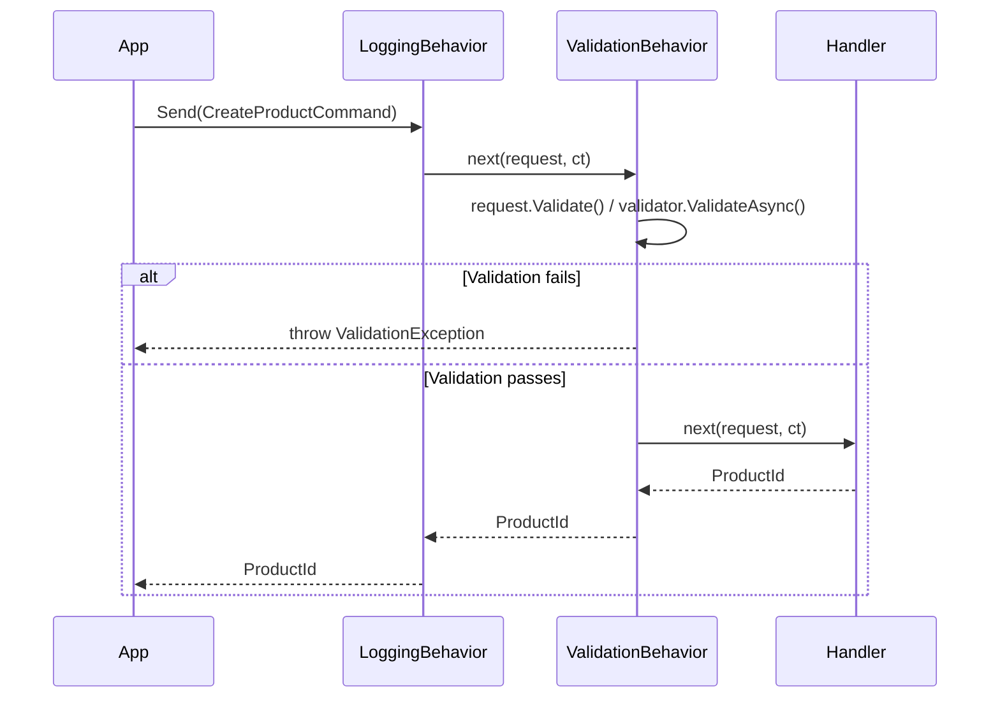

# Cookbook: Validation with Pipeline Behaviors

Validation belongs in the pipeline, not in handlers. A validation behavior runs before every command, catching invalid input before it reaches business logic. This recipe shows two approaches: a hand-rolled `IValidatable` marker interface for simple projects, and FluentValidation for richer rule sets.

## Approach 1 — Hand-Rolled IValidatable

Define a marker interface on request types:

```csharp
public interface IValidatable
{
    IReadOnlyList<string> Validate();
}
```

Two commands implementing it:

```csharp
public readonly record struct CreateProductCommand(
    string Name,
    string Sku,
    decimal Price,
    int StockLevel
) : IRequest<ProductId>, IValidatable
{
    public IReadOnlyList<string> Validate()
    {
        var errors = new List<string>();
        if (string.IsNullOrWhiteSpace(Name))   errors.Add("Name is required.");
        if (string.IsNullOrWhiteSpace(Sku))    errors.Add("Sku is required.");
        if (!System.Text.RegularExpressions.Regex.IsMatch(Sku ?? "", @"^[A-Z]{3}-\d{3}$"))
            errors.Add("Sku must match format AAA-000 (e.g. WGT-001).");
        if (Price <= 0)     errors.Add("Price must be greater than zero.");
        if (StockLevel < 0) errors.Add("Stock level cannot be negative.");
        return errors;
    }
}

public readonly record struct PlaceOrderCommand(
    string CustomerId,
    IReadOnlyList<OrderLineItem> Items
) : IRequest<OrderId>, IValidatable
{
    public IReadOnlyList<string> Validate()
    {
        var errors = new List<string>();
        if (string.IsNullOrWhiteSpace(CustomerId)) errors.Add("CustomerId is required.");
        if (Items is null || Items.Count == 0)     errors.Add("Order must contain at least one item.");
        if (Items?.Any(i => i.Quantity <= 0) == true)
            errors.Add("All item quantities must be positive.");
        return errors;
    }
}
```

The validation behavior:

```csharp
[PipelineBehavior(Order = 10)]
public static class ValidationBehavior
{
    public static async ValueTask<TResponse> Handle<TRequest, TResponse>(
        TRequest request,
        CancellationToken ct,
        Func<TRequest, CancellationToken, ValueTask<TResponse>> next)
    {
        if (request is IValidatable validatable)
        {
            var errors = validatable.Validate();
            if (errors.Count > 0)
                throw new ValidationException(errors);
        }

        return await next(request, ct);
    }
}

public class ValidationException : Exception
{
    public IReadOnlyList<string> Errors { get; }

    public ValidationException(IReadOnlyList<string> errors)
        : base($"Validation failed: {string.Join("; ", errors)}")
    {
        Errors = errors;
    }
}
```

## Approach 2 — FluentValidation

Install:

```bash
dotnet add package FluentValidation
```

Define validators:

```csharp
using FluentValidation;

public class CreateProductCommandValidator : AbstractValidator<CreateProductCommand>
{
    public CreateProductCommandValidator()
    {
        RuleFor(x => x.Name)
            .NotEmpty().WithMessage("Name is required.")
            .MaximumLength(200).WithMessage("Name cannot exceed 200 characters.");

        RuleFor(x => x.Sku)
            .NotEmpty().WithMessage("Sku is required.")
            .Matches(@"^[A-Z]{3}-\d{3}$").WithMessage("Sku must match format AAA-000 (e.g. WGT-001).");

        RuleFor(x => x.Price)
            .GreaterThan(0).WithMessage("Price must be greater than zero.");

        RuleFor(x => x.StockLevel)
            .GreaterThanOrEqualTo(0).WithMessage("Stock level cannot be negative.");
    }
}

public class PlaceOrderCommandValidator : AbstractValidator<PlaceOrderCommand>
{
    public PlaceOrderCommandValidator()
    {
        RuleFor(x => x.CustomerId).NotEmpty().WithMessage("CustomerId is required.");
        RuleFor(x => x.Items).NotEmpty().WithMessage("Order must contain at least one item.");
        RuleForEach(x => x.Items)
            .ChildRules(item => item.RuleFor(i => i.Quantity).GreaterThan(0));
    }
}
```

Register validators and wire up the behavior:

```csharp
// Program.cs — register all validators from the assembly
builder.Services.AddValidatorsFromAssemblyContaining<CreateProductCommandValidator>();
```

FluentValidation behavior (resolves validators from DI using an ambient scope):

```csharp
using FluentValidation;
using System.Collections.Concurrent;

[PipelineBehavior(Order = 10)]
public static class FluentValidationBehavior
{
    // Cache validator instances to avoid repeated service resolution overhead
    private static readonly ConcurrentDictionary<Type, object?> _validatorCache = new();

    public static async ValueTask<TResponse> Handle<TRequest, TResponse>(
        TRequest request,
        CancellationToken ct,
        Func<TRequest, CancellationToken, ValueTask<TResponse>> next)
    {
        var validator = GetValidator<TRequest>();
        if (validator is not null)
        {
            var context = new ValidationContext<TRequest>(request);
            var result = await validator.ValidateAsync(context, ct);
            if (!result.IsValid)
                throw new FluentValidation.ValidationException(result.Errors);
        }

        return await next(request, ct);
    }

    private static IValidator<TRequest>? GetValidator<TRequest>()
    {
        // Resolve from ambient DI scope (set up in middleware)
        var sp = AmbientServiceProvider.Current;
        return sp?.GetService<IValidator<TRequest>>();
    }
}

// Ambient service provider — set in ASP.NET Core middleware
public static class AmbientServiceProvider
{
    private static readonly AsyncLocal<IServiceProvider?> _current = new();
    public static IServiceProvider? Current
    {
        get => _current.Value;
        set => _current.Value = value;
    }
}

// Middleware to set ambient scope per request
app.Use(async (ctx, next) =>
{
    AmbientServiceProvider.Current = ctx.RequestServices;
    await next();
});
```

## Validation in the Pipeline



## Handling Validation Errors in Minimal API

```csharp
app.MapPost("/products", async (CreateProductRequest req, IMediator mediator, CancellationToken ct) =>
{
    try
    {
        var id = await mediator.Send(
            new CreateProductCommand(req.Name, req.Sku, req.Price, req.StockLevel), ct);
        return Results.Created($"/products/{id.Value}", id);
    }
    catch (ValidationException ex)
    {
        return Results.ValidationProblem(
            ex.Errors.ToDictionary(e => "validation", e => new[] { e }));
    }
});

// Or with FluentValidation:
catch (FluentValidation.ValidationException ex)
{
    var errors = ex.Errors
        .GroupBy(e => e.PropertyName)
        .ToDictionary(g => g.Key, g => g.Select(e => e.ErrorMessage).ToArray());
    return Results.ValidationProblem(errors);
}
```

## Choosing Between the Two Approaches

| | Hand-Rolled IValidatable | FluentValidation |
|---|---|---|
| Setup | No extra packages | `FluentValidation` NuGet |
| Rules on struct | Inline in the struct | Separate validator class |
| Conditional rules | Manual | Rich DSL (`When`, `Unless`) |
| Cross-field rules | Manual | `Must`, `Custom` |
| i18n | Manual | Built-in `WithMessage` |
| Best for | Simple CRUD validation | Complex domain rules |

## Related

- [Pipeline Behaviors](../pipeline-behaviors.md)
- [Requests & Handlers](../requests.md)
- [CQRS Web API](01-cqrs-web-api.md)
