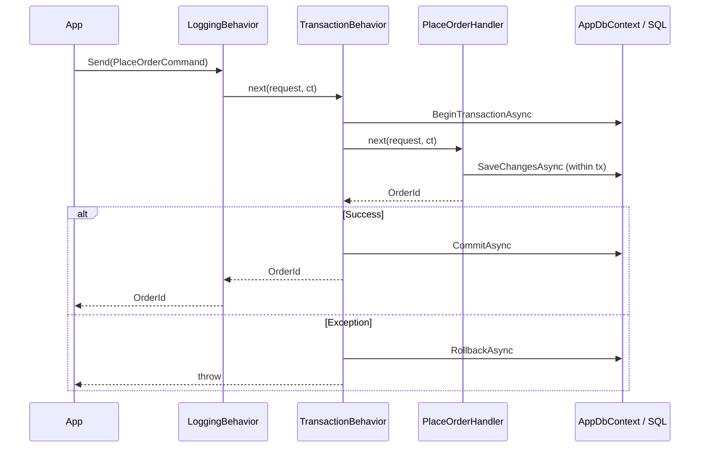

# Cookbook: Transactional Pipeline with EF Core

Wrapping command handlers in a database transaction ensures that all writes in a single command either fully commit or fully roll back. This recipe implements a transaction behavior using EF Core — commands get wrapped automatically; read-only queries bypass it entirely.

## Marking Commands as Transactional

Use a marker interface to identify which requests need a transaction:

```csharp
/// <summary>Marks a request as requiring a database transaction.</summary>
public interface ITransactionalRequest { }

// Commands opt in:
public readonly record struct PlaceOrderCommand(string CustomerId, IReadOnlyList<OrderLineItem> Items)
    : IRequest<OrderId>, ITransactionalRequest;

public readonly record struct CreateProductCommand(string Name, string Sku, decimal Price, int StockLevel)
    : IRequest<ProductId>, ITransactionalRequest;

// Queries do NOT opt in — they bypass the transaction behavior:
public readonly record struct GetProductQuery(Guid ProductId) : IRequest<ProductDto>;
public readonly record struct ListOrdersQuery(string CustomerId) : IRequest<IReadOnlyList<OrderSummary>>;
```

## Accessing the DbContext from a Static Behavior

Static behaviors have no instance state. The cleanest solution for ASP.NET Core is an `AsyncLocal` ambient scope, set in middleware per HTTP request.

```csharp
/// <summary>Thread-safe ambient access to the current request's IServiceProvider.</summary>
public static class AmbientScope
{
    private static readonly AsyncLocal<IServiceProvider?> _current = new();

    public static IServiceProvider? Current
    {
        get => _current.Value;
        set => _current.Value = value;
    }
}
```

Register the middleware in `Program.cs`:

```csharp
// Set ambient scope before any handler runs
app.Use(async (ctx, next) =>
{
    AmbientScope.Current = ctx.RequestServices;
    await next();
});
```

## The Transaction Behavior

```csharp
using Microsoft.EntityFrameworkCore;
using Microsoft.EntityFrameworkCore.Storage;
using ZeroAlloc.Mediator;

[PipelineBehavior(Order = 5)]   // Run after logging (0) but before validation (10)
public static class TransactionBehavior
{
    public static async ValueTask<TResponse> Handle<TRequest, TResponse>(
        TRequest request,
        CancellationToken ct,
        Func<TRequest, CancellationToken, ValueTask<TResponse>> next)
    {
        // Skip non-transactional requests (queries)
        if (request is not ITransactionalRequest)
            return await next(request, ct);

        var db = AmbientScope.Current?.GetRequiredService<AppDbContext>()
            ?? throw new InvalidOperationException(
                "No ambient DbContext found. Ensure AmbientScope middleware is registered.");

        await using IDbContextTransaction tx = await db.Database.BeginTransactionAsync(ct);
        try
        {
            var response = await next(request, ct);
            await tx.CommitAsync(ct);
            return response;
        }
        catch
        {
            await tx.RollbackAsync(ct);
            throw;
        }
    }
}
```

## Handler Using the Same DbContext

Because the `DbContext` is resolved from the request's DI scope (same `IServiceProvider` used by the behavior), the handler gets the **same** `DbContext` instance and therefore participates in the same transaction:

```csharp
public class PlaceOrderHandler : IRequestHandler<PlaceOrderCommand, OrderId>
{
    private readonly AppDbContext _db;

    public PlaceOrderHandler(AppDbContext db) => _db = db;

    public async ValueTask<OrderId> Handle(PlaceOrderCommand cmd, CancellationToken ct)
    {
        var order = new Order
        {
            Id = Guid.NewGuid(),
            CustomerId = cmd.CustomerId,
            Status = OrderStatus.Pending,
            PlacedAt = DateTimeOffset.UtcNow
        };

        foreach (var item in cmd.Items)
        {
            order.Lines.Add(new OrderLine
            {
                Sku = item.Sku,
                Quantity = item.Quantity,
                UnitPrice = item.UnitPrice
            });
        }

        _db.Orders.Add(order);
        await _db.SaveChangesAsync(ct);  // Writes within the open transaction

        return new OrderId(order.Id);
    }
}
```

## Transaction Flow



## DI Registration

```csharp
// Register DbContext as scoped (default)
builder.Services.AddDbContext<AppDbContext>(options =>
    options.UseSqlServer(builder.Configuration.GetConnectionString("Default")));

// Handler uses DbContext via constructor injection
builder.Services.AddTransient<PlaceOrderHandler>();
builder.Services.AddTransient<CreateProductHandler>();

// Register IMediator
builder.Services.AddSingleton<IMediator>(sp =>
{
    Mediator.Configure(cfg =>
    {
        cfg.SetFactory(() => sp.GetRequiredService<PlaceOrderHandler>());
        cfg.SetFactory(() => sp.GetRequiredService<CreateProductHandler>());
        // ... other handlers
    });
    return new MediatorService();
});

// Middleware (must be before endpoint routing)
app.Use(async (ctx, next) =>
{
    AmbientScope.Current = ctx.RequestServices;
    await next();
});
```

## Publishing Events After Commit

If you publish domain events inside the handler (while still inside the transaction), notification handlers run before you know if the commit will succeed. This can cause emails or other side effects to fire for a transaction that gets rolled back.

**Pattern: collect events in the handler, publish after commit:**

```csharp
[PipelineBehavior(Order = 5)]
public static class TransactionBehavior
{
    public static async ValueTask<TResponse> Handle<TRequest, TResponse>(
        TRequest request,
        CancellationToken ct,
        Func<TRequest, CancellationToken, ValueTask<TResponse>> next)
    {
        if (request is not ITransactionalRequest)
            return await next(request, ct);

        var db = AmbientScope.Current?.GetRequiredService<AppDbContext>()
            ?? throw new InvalidOperationException("No ambient DbContext.");

        await using var tx = await db.Database.BeginTransactionAsync(ct);
        try
        {
            var response = await next(request, ct);
            await tx.CommitAsync(ct);

            // Publish events AFTER commit — side effects only for committed data
            if (db.PendingDomainEvents.Count > 0)
            {
                var events = db.PendingDomainEvents.ToList();
                db.PendingDomainEvents.Clear();
                foreach (var evt in events)
                    await Mediator.Publish(evt, ct);
            }

            return response;
        }
        catch
        {
            await tx.RollbackAsync(ct);
            throw;
        }
    }
}
```

## Related

- [Pipeline Behaviors](../05-pipeline-behaviors.md)
- [Dependency Injection](../06-dependency-injection.md)
- [Event-Driven Architecture](02-event-driven.md)
