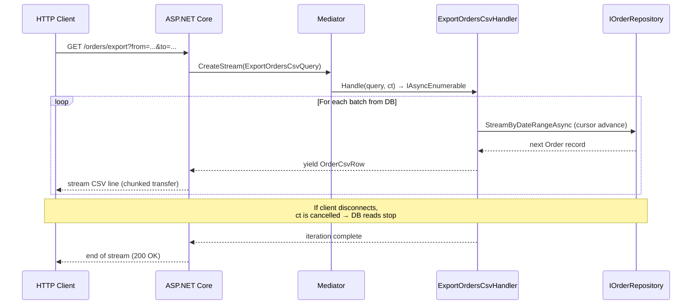

# Cookbook: Streaming Large Datasets

When a result set is too large to load into memory at once, stream it. Rather than accumulating all rows in a `List<T>` before sending anything to the caller, `IStreamRequest<TResponse>` lets you yield results one at a time as they arrive from the database — keeping peak memory flat regardless of result-set size.

This recipe covers two real-world scenarios: a CSV export endpoint that streams rows directly to an HTTP response, and a cursor-based pagination API that yields pages on demand.

## Scenario 1 — CSV Export Endpoint

A finance team wants to export all orders in a date range as a downloadable CSV. Loading 100 000 orders into a `List<Order>` would spike memory. Instead, stream rows as they come from the database and write each one to the response body immediately.

**Request and row types**

```csharp
using ZeroAlloc.Mediator;

public readonly record struct ExportOrdersCsvQuery(
    DateTimeOffset From,
    DateTimeOffset To,
    string? CustomerId = null
) : IStreamRequest<OrderCsvRow>;

public readonly record struct OrderCsvRow(
    string OrderId,
    string CustomerId,
    string Status,
    decimal TotalAmount,
    string PlacedAt
);
```

**Handler**

```csharp
using System.Runtime.CompilerServices;

public class ExportOrdersCsvHandler : IStreamRequestHandler<ExportOrdersCsvQuery, OrderCsvRow>
{
    private readonly IOrderRepository _repo;

    public ExportOrdersCsvHandler(IOrderRepository repo) => _repo = repo;

    public async IAsyncEnumerable<OrderCsvRow> Handle(
        ExportOrdersCsvQuery query,
        [EnumeratorCancellation] CancellationToken ct)
    {
        await foreach (var order in _repo.StreamByDateRangeAsync(
            query.From, query.To, query.CustomerId, ct))
        {
            ct.ThrowIfCancellationRequested();
            yield return new OrderCsvRow(
                order.Id.ToString("D"),
                order.CustomerId,
                order.Status.ToString(),
                order.TotalAmount,
                order.PlacedAt.ToString("O"));
        }
    }
}
```

**ASP.NET Core endpoint**

The endpoint streams CSV directly to the response body without buffering the entire file in memory first.

```csharp
app.MapGet("/orders/export", async (
    DateTimeOffset from,
    DateTimeOffset to,
    string? customerId,
    IMediator mediator,
    HttpResponse response,
    CancellationToken ct) =>
{
    response.ContentType = "text/csv";
    response.Headers.ContentDisposition = "attachment; filename=\"orders.csv\"";

    await using var writer = new StreamWriter(response.Body, leaveOpen: true);
    await writer.WriteLineAsync("OrderId,CustomerId,Status,TotalAmount,PlacedAt");

    var rowCount = 0;
    await foreach (var row in mediator.CreateStream(
        new ExportOrdersCsvQuery(from, to, customerId), ct))
    {
        await writer.WriteLineAsync(
            $"{row.OrderId},{EscapeCsv(row.CustomerId)},{row.Status},{row.TotalAmount},{row.PlacedAt}");
        rowCount++;

        // Flush every 1000 rows to prevent the write buffer from growing unbounded
        if (rowCount % 1000 == 0)
            await writer.FlushAsync(ct);
    }
});

static string EscapeCsv(string value) =>
    value.Contains(',') || value.Contains('"') ? $"\"{value.Replace("\"", "\"\"")}\"" : value;
```

## Scenario 2 — Cursor-Based Pagination Stream

A dashboard needs to list all products in a category, but there may be tens of thousands of them. Rather than fetching everything at once, yield one page at a time — the consumer can stop after the first few pages without ever fetching the rest.

**Request and page types**

```csharp
public readonly record struct ListProductsPagedQuery(
    string? Category = null,
    int PageSize = 50
) : IStreamRequest<ProductPage>;

public readonly record struct ProductPage(
    IReadOnlyList<ProductDto> Items,
    int PageNumber,
    bool HasMore
);
```

**Handler** — using offset-based pagination here, but the same pattern applies to keyset (cursor) pagination:

```csharp
public class ListProductsPagedHandler
    : IStreamRequestHandler<ListProductsPagedQuery, ProductPage>
{
    private readonly IProductRepository _repo;

    public ListProductsPagedHandler(IProductRepository repo) => _repo = repo;

    public async IAsyncEnumerable<ProductPage> Handle(
        ListProductsPagedQuery query,
        [EnumeratorCancellation] CancellationToken ct)
    {
        var page = 1;
        bool hasMore;

        do
        {
            var items = await _repo.GetPageAsync(query.Category, page, query.PageSize, ct);
            hasMore = items.Count == query.PageSize;

            yield return new ProductPage(
                items.Select(p => new ProductDto(p.Id, p.Name, p.Sku, p.Price, p.StockLevel, p.IsArchived)).ToList(),
                page,
                hasMore);

            page++;
        } while (hasMore && !ct.IsCancellationRequested);
    }
}
```

**Consumer — process only the first two pages**

Breaking out of an `await foreach` loop automatically cancels the underlying stream. The handler's `ct.IsCancellationRequested` check means the next database fetch never happens.

```csharp
var pageNumber = 0;
await foreach (var page in Mediator.CreateStream(new ListProductsPagedQuery("Electronics")))
{
    Console.WriteLine($"Page {page.PageNumber}: {page.Items.Count} products");
    foreach (var product in page.Items)
        ProcessProduct(product);

    if (++pageNumber >= 2)
        break; // Stop early — stream is cancelled automatically
}
```

## Streaming Architecture



## Back-Pressure and Cancellation

**Cancellation is wired automatically in ASP.NET Core.** `HttpContext.RequestAborted` is passed into the endpoint's `CancellationToken` by the framework. If the browser tab closes or the client disconnects mid-download, the token is cancelled and `ct.ThrowIfCancellationRequested()` in the handler stops the database reads immediately — no wasted work, no memory leak.

**Always propagate the token to your upstream source.** If your repository or data source accepts a `CancellationToken`, pass `ct` through. This is the most efficient path: the query is cancelled at the database driver level before the next row is even read.

**Add an explicit guard when the upstream source ignores cancellation.** Call `ct.ThrowIfCancellationRequested()` at the top of your `yield return` loop when the upstream does not accept a token (e.g., a third-party SDK). This ensures the handler stops at the start of the next iteration rather than processing one extra row unnecessarily.

**Flush the response writer periodically for large exports.** The `StreamWriter` internal buffer will grow until it is explicitly flushed. Flushing every 500–1000 rows keeps memory usage flat and starts delivering bytes to the client sooner, which also gives the framework earlier feedback if the connection has dropped.

## Memory Profile Comparison

| Approach | Peak Memory (100k rows) | Time to First Byte |
|---|---|---|
| `List<Order>` (buffered) | ~200–500 MB | After all rows loaded |
| Streaming (`IAsyncEnumerable`) | ~1–5 MB (one row at a time) | Immediately |

The buffered approach must hold every row in memory simultaneously before writing a single byte to the response. The streaming approach holds at most one row (or one page) at a time, so peak memory is bounded by the size of a single item regardless of how many rows exist in the database.

## Related

- [Streaming](../04-streaming.md)
- [CQRS Web API](01-cqrs-web-api.md)
- [Testing Handlers](06-testing-handlers.md)
