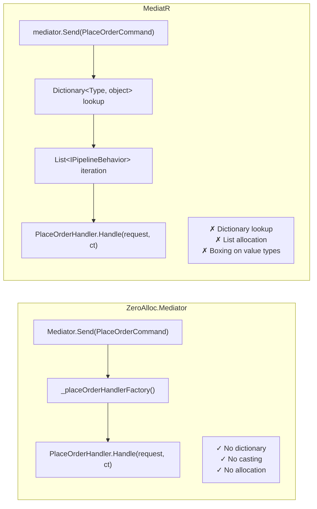

# Performance

ZeroAlloc.Mediator is built for hot paths where mediator overhead would otherwise be measurable. This page explains the four design decisions that eliminate allocation, the benchmark results that validate them, and guidance for when zero-allocation actually matters in practice.

## Why Mediators Usually Allocate

Libraries like MediatR perform several heap operations on every dispatch:

- Maintain a `Dictionary<Type, object>` mapping request types to handler factories
- Build and iterate a `List<IPipelineBehavior<TRequest, TResponse>>` per dispatch
- Box value types when passing through generic interfaces
- Allocate `Task<TResponse>` objects even for synchronous completions
- Use reflection or compiled expressions for handler resolution

Each of these is a heap allocation. Under high throughput (10k+ req/sec), GC pressure builds up. The minor GC pauses that result may be invisible at low load but become measurable — and sometimes dominant — in latency-sensitive or high-throughput workloads.

## How ZeroAlloc.Mediator Eliminates Allocation

Four architectural decisions make zero allocation possible.

### 1. Compile-time dispatch

The Roslyn source generator emits one strongly-typed overload per request type. No dictionary. No casting.

```csharp
// Generated — called directly, zero lookup overhead
public static ValueTask<OrderId> Send(
    PlaceOrderCommand request, CancellationToken ct = default)
    => (_placeOrderHandlerFactory?.Invoke() ?? new PlaceOrderHandler()).Handle(request, ct);
```

Because the overload is resolved at compile time, the call site is a direct method invocation with no runtime type inspection or dictionary lookup.

### 2. Inlined pipeline behaviors

Behaviors become nested static lambda calls, not a list to iterate.

```csharp
// Conceptual generated output with 2 behaviors
public static ValueTask<OrderId> Send(PlaceOrderCommand request, CancellationToken ct = default)
    => LoggingBehavior.Handle(request, ct, (req, token) =>
        ValidationBehavior.Handle(req, token, (req2, token2) =>
            (_placeOrderHandlerFactory?.Invoke() ?? new PlaceOrderHandler()).Handle(req2, token2)));
```

The pipeline is a static call chain baked in at code generation time. There is no `List<IPipelineBehavior>` allocated or iterated at runtime.

### 3. Value type requests

`readonly record struct` means the request data lives on the stack for synchronous call chains. No heap allocation for the request itself.

```csharp
public readonly record struct PlaceOrderCommand(CustomerId CustomerId, ProductId ProductId) : IRequest<OrderId>;
```

Passing a struct through the generated overloads keeps it on the stack. Only async continuations that capture the struct cause a heap allocation — and only when the handler actually suspends.

### 4. ValueTask over Task

`ValueTask<TResponse>` completes without allocating a `Task` object when the handler returns synchronously or via `ValueTask.FromResult(...)`.

```csharp
public ValueTask<OrderId> Handle(PlaceOrderCommand request, CancellationToken ct)
    => ValueTask.FromResult(new OrderId(Guid.NewGuid())); // 0 B allocated
```

For I/O-bound handlers that do suspend, `ValueTask` still reduces overhead compared to `Task` on the fast path.

## Benchmark Results

Benchmarks run with BenchmarkDotNet on .NET 10, Release build, 12th Gen Intel Core i9-12900HK. Full benchmark source in `tests/ZeroAlloc.Mediator.Benchmarks/`.

| Method | ZeroAlloc.Mediator | MediatR | Ratio | ZA Alloc | MediatR Alloc |
|---|---:|---:|---:|---:|---:|
| Send | 0.5 ns | 78.3 ns | **~160×** | 0 B | 224 B |
| Publish (1 handler) | 6.1 ns | 243.8 ns | **~40×** | 0 B | 792 B |
| Publish (multi handler) | 6.6 ns | 332.4 ns | **~51×** | 0 B | 1032 B |
| Send + Pipeline | 2.8 ns | 101.8 ns | **~46×** | 0 B | 152 B |
| Send (static) | 0.7 ns | — | — | 0 B | — |
| Send (via IMediator DI) | 5.8 ns | 86.3 ns | **~15×** | 0 B | 224 B |
| Stream (5 items) | 202.8 ns | 654.4 ns | **~3×** | 104 B | 528 B |

ZeroAlloc.Mediator is **40–160× faster** than MediatR across all measured paths, with zero heap allocations on every non-streaming path.

## Dispatch Comparison



## Native AOT

ZeroAlloc.Mediator is fully AOT-compatible. There is no reflection at runtime — all dispatch is statically compiled. To publish as Native AOT:

```xml
<PropertyGroup>
    <PublishAot>true</PublishAot>
    <InvariantGlobalization>true</InvariantGlobalization>
</PropertyGroup>
```

```bash
dotnet publish -r linux-x64 -c Release
```

The generated code uses no `Type.GetType()`, no `Activator.CreateInstance()`, no expression trees, and no dynamic methods — all of which break under AOT. Because the source generator runs at compile time and emits plain C# with no runtime type inspection, the published binary contains only direct method calls.

## When Zero Allocation Matters

**It matters for:**

- Background processing loops handling >10k messages/second
- Low-latency APIs where p99 latency is a hard requirement
- .NET Native AOT deployments where JIT warm-up doesn't exist
- Memory-constrained environments (containers with <256 MB, IoT, embedded .NET)
- High-frequency financial or telemetry pipelines

**It probably doesn't matter for:**

- Standard web APIs handling <1k req/sec (the 100 ns MediatR cost is ~0.0001% of a 100 ms response time)
- Batch jobs that run once a day
- CRUD APIs where the database round-trip dominates latency by 5–6 orders of magnitude

If your profiler or allocation tracker does not show the mediator as a hotspot, the performance characteristics between ZeroAlloc.Mediator and MediatR are irrelevant for your use case. Choose based on API ergonomics or AOT requirements instead.

## Tips for Maximum Performance

1. **Use `readonly record struct` for all request and notification types** — the single highest-impact change. Keeping requests on the stack eliminates the per-request heap allocation entirely on sync paths.

2. **Use `ValueTask.FromResult(value)` in sync handlers** — avoids `Task` allocation. Return `ValueTask<TResponse>` directly rather than wrapping in `Task.FromResult`.

3. **Use static `Mediator.Send` on hot paths** — skip the `IMediator` virtual call when throughput matters. The static overloads are direct calls; the interface dispatch adds one indirection.

4. **Keep pipeline behaviors stateless and `static`** — no instance allocation per request. A `static` behavior method captured in a lambda does not close over any heap object.

5. **Use `[ParallelNotification]` for independent notification handlers** — reduces wall-clock time on multi-handler notifications by dispatching handlers concurrently rather than sequentially.
