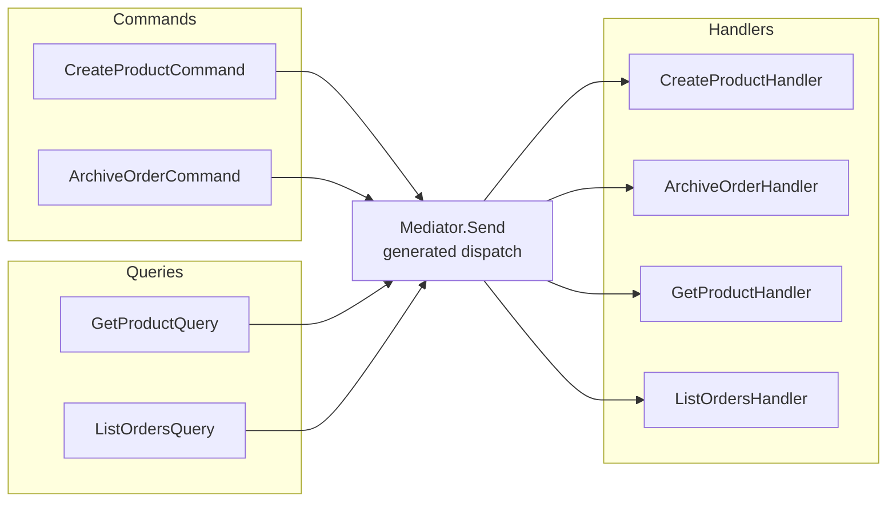

# Requests & Handlers

Requests are the primary unit of work in the mediator pattern. Commands mutate state (create, update, delete); queries read state. Both use `IRequest<TResponse>`. The handler is the single place responsible for executing the operation.

## IRequest\<TResponse\> — Requests with a Return Value

### Command Example

```csharp
using ZeroAlloc.Mediator;

public readonly record struct CreateProductCommand(
    string Name,
    string Sku,
    decimal Price,
    int StockLevel
) : IRequest<ProductId>;

public readonly record struct ProductId(Guid Value);
```

```csharp
public class CreateProductHandler : IRequestHandler<CreateProductCommand, ProductId>
{
    private readonly IProductRepository _repo;

    public CreateProductHandler(IProductRepository repo) => _repo = repo;

    public async ValueTask<ProductId> Handle(CreateProductCommand cmd, CancellationToken ct)
    {
        var product = new Product(cmd.Name, cmd.Sku, cmd.Price, cmd.StockLevel);
        await _repo.SaveAsync(product, ct);
        return new ProductId(product.Id);
    }
}
```

### Query Example

```csharp
public readonly record struct GetProductQuery(Guid ProductId) : IRequest<ProductDto>;

public readonly record struct ProductDto(Guid Id, string Name, string Sku, decimal Price);
```

```csharp
public class GetProductHandler : IRequestHandler<GetProductQuery, ProductDto>
{
    private readonly IProductRepository _repo;

    public GetProductHandler(IProductRepository repo) => _repo = repo;

    public async ValueTask<ProductDto> Handle(GetProductQuery query, CancellationToken ct)
    {
        var product = await _repo.FindAsync(query.ProductId, ct)
            ?? throw new ProductNotFoundException(query.ProductId);

        return new ProductDto(product.Id, product.Name, product.Sku, product.Price);
    }
}
```

## IRequest — Fire-and-Forget

`IRequest` is shorthand for `IRequest<Unit>`. Use it when a command does not need to return data. `Unit` is a `readonly record struct` with a static `Unit.Value` field — handlers return it in place of `void`.

```csharp
public readonly record struct ArchiveOrderCommand(Guid OrderId) : IRequest;

public class ArchiveOrderHandler : IRequestHandler<ArchiveOrderCommand, Unit>
{
    private readonly IOrderRepository _repo;

    public ArchiveOrderHandler(IOrderRepository repo) => _repo = repo;

    public async ValueTask<Unit> Handle(ArchiveOrderCommand cmd, CancellationToken ct)
    {
        await _repo.ArchiveAsync(cmd.OrderId, ct);
        return Unit.Value;
    }
}

// Calling it — return value is Unit and can be ignored:
await Mediator.Send(new ArchiveOrderCommand(orderId));
```

## Dispatching

```csharp
// Basic dispatch
var productId = await Mediator.Send(new CreateProductCommand("Widget", "WGT-001", 9.99m, 100));

// With explicit cancellation token
using var cts = new CancellationTokenSource(TimeSpan.FromSeconds(5));
var dto = await Mediator.Send(new GetProductQuery(productId.Value), cts.Token);
```

## CQRS Dispatch Flow



Each arrow represents a separate compile-time generated overload. There is no runtime switching.

## Rules & Best Practices

- Requests **must** be `readonly record struct`. A class request compiles but triggers diagnostic **ZAM003** and causes boxing.
- Exactly **one** handler per request type. Multiple handlers = compile error **ZAM002**.
- Missing handler = compile error **ZAM001** — caught at build time, not runtime.
- Keep requests as pure data — no methods, no services, no logic inside the struct.
- Use `ValueTask.FromResult(value)` in handlers that don't do async work, to avoid allocating a `Task`.

## Common Pitfalls

**Pitfall 1 — Class request type**

```csharp
// ❌ Triggers ZAM003 warning, causes boxing
public class GetProductQuery : IRequest<ProductDto> { ... }

// ✅ Correct
public readonly record struct GetProductQuery(Guid ProductId) : IRequest<ProductDto>;
```

**Pitfall 2 — Handler with constructor dependencies but no DI configured**

If your handler has constructor parameters, you must either configure factories via `Mediator.Configure()` or use the `IMediator`/`MediatorService` DI integration. See [Dependency Injection](dependency-injection.md).

**Pitfall 3 — Forgetting `return Unit.Value`**

```csharp
// ❌ Won't compile
public ValueTask<Unit> Handle(ArchiveOrderCommand cmd, CancellationToken ct)
{
    // forgot to return Unit.Value
}

// ✅ Correct
public ValueTask<Unit> Handle(ArchiveOrderCommand cmd, CancellationToken ct)
{
    _repo.Archive(cmd.OrderId);
    return ValueTask.FromResult(Unit.Value);
}
```

**Pitfall 4 — Doing async work then returning synchronously**

```csharp
// ❌ Allocates a Task unnecessarily
return Task.FromResult(new ProductId(id)).Result; // never do this

// ✅ Use ValueTask for zero allocation on sync paths
return ValueTask.FromResult(new ProductId(id));
```
