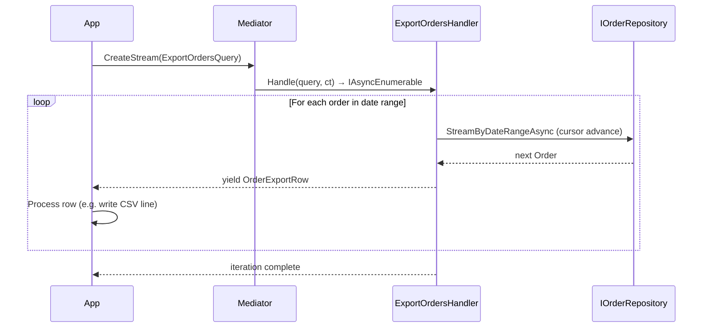

# Streaming

Streaming lets a handler yield results one at a time as `IAsyncEnumerable<T>`. Instead of loading an entire result set into memory and returning it all at once, the consumer processes items as they arrive. This is ideal for large exports, paginated feeds, real-time data, or any result set that may exceed available memory.

## Defining a Stream Request

The following example models exporting all orders in a date range for a finance report.

```csharp
using ZeroAlloc.Mediator;

public readonly record struct ExportOrdersQuery(
    DateTimeOffset From,
    DateTimeOffset To,
    string? CustomerId = null
) : IStreamRequest<OrderExportRow>;

public readonly record struct OrderExportRow(
    Guid OrderId,
    string CustomerId,
    string Status,
    decimal TotalAmount,
    DateTimeOffset PlacedAt
);
```

## Implementing the Handler

```csharp
using System.Runtime.CompilerServices;

public class ExportOrdersHandler : IStreamRequestHandler<ExportOrdersQuery, OrderExportRow>
{
    private readonly IOrderRepository _repo;

    public ExportOrdersHandler(IOrderRepository repo) => _repo = repo;

    public async IAsyncEnumerable<OrderExportRow> Handle(
        ExportOrdersQuery query,
        [EnumeratorCancellation] CancellationToken ct)
    {
        await foreach (var order in _repo.StreamByDateRangeAsync(query.From, query.To, query.CustomerId, ct))
        {
            ct.ThrowIfCancellationRequested();
            yield return new OrderExportRow(
                order.Id,
                order.CustomerId,
                order.Status.ToString(),
                order.TotalAmount,
                order.PlacedAt);
        }
    }
}
```

`[EnumeratorCancellation]` ensures the `CancellationToken` passed to `CreateStream` propagates correctly into the `async IAsyncEnumerable` iterator.

## Consuming the Stream

```csharp
var query = new ExportOrdersQuery(
    DateTimeOffset.UtcNow.AddDays(-30),
    DateTimeOffset.UtcNow);

await foreach (var row in Mediator.CreateStream(query, ct))
{
    await csvWriter.WriteRowAsync(row, ct);
}
```

Consuming with LINQ (requires the `System.Linq.Async` package):

```csharp
var recentOrders = await Mediator
    .CreateStream(new ExportOrdersQuery(DateTimeOffset.UtcNow.AddDays(-7), DateTimeOffset.UtcNow))
    .Where(r => r.TotalAmount > 100m)
    .ToListAsync(ct);
```

## Streaming in ASP.NET Core

The following endpoint streams a large report as a CSV download without buffering the entire file in memory.

```csharp
app.MapGet("/orders/export", async (
    DateTimeOffset from,
    DateTimeOffset to,
    string? customerId,
    IMediator mediator,
    HttpResponse response,
    CancellationToken ct) =>
{
    response.ContentType = "text/csv";
    response.Headers.ContentDisposition = "attachment; filename=\"orders.csv\"";

    await using var writer = new StreamWriter(response.Body);
    await writer.WriteLineAsync("OrderId,CustomerId,Status,TotalAmount,PlacedAt");

    await foreach (var row in mediator.CreateStream(
        new ExportOrdersQuery(from, to, customerId), ct))
    {
        await writer.WriteLineAsync(
            $"{row.OrderId},{row.CustomerId},{row.Status},{row.TotalAmount},{row.PlacedAt:O}");
    }
});
```

ASP.NET Core wires `HttpContext.RequestAborted` into `ct` automatically — if the client disconnects, the stream is cancelled and DB reads stop.

## Real-Time Feed Example

The following example tails live log entries for a service dashboard.

```csharp
public readonly record struct TailServiceLogsQuery(
    string ServiceName,
    string? MinLevel = null
) : IStreamRequest<LogEntry>;

public readonly record struct LogEntry(
    DateTimeOffset Timestamp,
    string Level,
    string Message,
    string? TraceId
);

public class TailServiceLogsHandler : IStreamRequestHandler<TailServiceLogsQuery, LogEntry>
{
    private readonly ILogStore _store;
    public TailServiceLogsHandler(ILogStore store) => _store = store;

    public async IAsyncEnumerable<LogEntry> Handle(
        TailServiceLogsQuery query,
        [EnumeratorCancellation] CancellationToken ct)
    {
        await foreach (var entry in _store.TailAsync(query.ServiceName, ct))
        {
            if (query.MinLevel is null || entry.Level >= query.MinLevel)
                yield return new LogEntry(entry.Timestamp, entry.Level, entry.Message, entry.TraceId);
        }
    }
}

// Consumer: cancel when the user closes the browser tab
using var cts = new CancellationTokenSource();
Console.CancelKeyPress += (_, e) => { e.Cancel = true; cts.Cancel(); };

await foreach (var entry in Mediator.CreateStream(new TailServiceLogsQuery("api-gateway"), cts.Token))
    Console.WriteLine($"[{entry.Timestamp:HH:mm:ss}] [{entry.Level}] {entry.Message}");
```

## Streaming Flow



## Common Pitfalls

**Pitfall 1 — Missing `[EnumeratorCancellation]`**

```csharp
// ❌ Cancellation will not propagate into the iterator
public async IAsyncEnumerable<OrderExportRow> Handle(
    ExportOrdersQuery query,
    CancellationToken ct) { ... }

// ✅ Correct
public async IAsyncEnumerable<OrderExportRow> Handle(
    ExportOrdersQuery query,
    [EnumeratorCancellation] CancellationToken ct) { ... }
```

**Pitfall 2 — Materialising the stream inside the handler**

```csharp
// ❌ Loads all orders into memory — defeats the purpose
var all = await _repo.GetAllAsync(ct); // List<Order> with 1M items
foreach (var o in all) yield return Map(o);

// ✅ Stream from the source
await foreach (var o in _repo.StreamAsync(ct))
    yield return Map(o);
```

**Pitfall 3 — Wrong return type (ZAM007)**

```csharp
// ❌ Returns IEnumerable<T> — triggers ZAM007 error
public IEnumerable<OrderExportRow> Handle(ExportOrdersQuery q, CancellationToken ct) { ... }

// ✅ Must return IAsyncEnumerable<T>
public async IAsyncEnumerable<OrderExportRow> Handle(
    ExportOrdersQuery q,
    [EnumeratorCancellation] CancellationToken ct) { ... }
```

**Pitfall 4 — Not checking cancellation in tight loops**

Always call `ct.ThrowIfCancellationRequested()` at the top of your yield loop when the upstream source doesn't accept a cancellation token.
